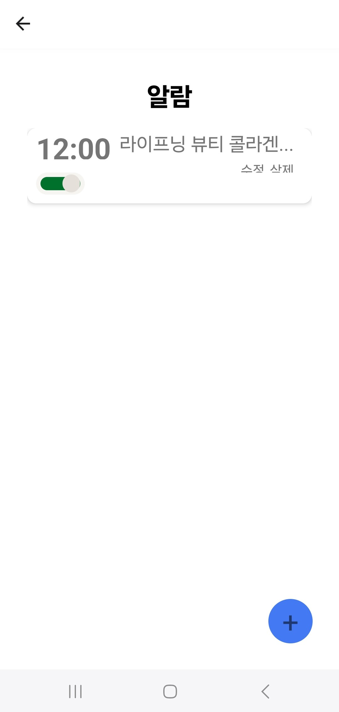
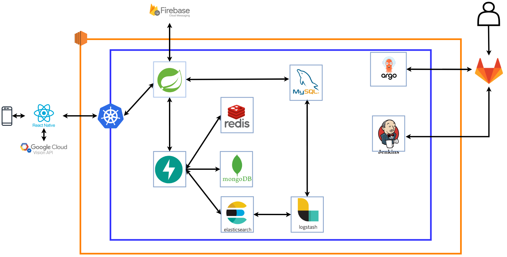
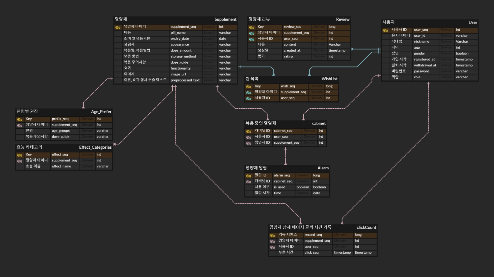

# Pillsoo

## 목차

- [프로젝트 소개](#프로젝트-소개)
- [주요 기능](#주요-기능)
- [차별점 및 독창성](#차별점-및-독창성)
- [서비스 화면](#서비스-화면)
- [주요 기술 스택](#주요-기술-스택)
    - [Frontend](#frontend)
    - [Backend](#backend)
    - [DB](#db)
    - [Infra](#infra)
- [산출물](산출물)
    - [인프라 아키텍처](#인프라-아키텍처)
    - [ERD](#erd)
    - [포팅 메뉴얼](#포팅-메뉴얼)

## 프로젝트 소개

📅 **진행 기간** : 2024.08.26 ~ 2024.10.11

영양제를 먹고 싶은데, 어떤 영양제를 먹어야 할지 모르시나요? 같은 연령대의 사람들이 많이 먹는 영양제가 무엇인지 궁금하신가요? 영양제를 먹는 것을 자주 잊어버리시나요? Pillsoo는 사용자의 데이터를 바탕으로 영양제를 추천해주고, 영양제 복용 알람을 설정할 수 있는 영양제 관리 플랫폼입니다.

## 주요 기능

- 영양제 검색
- 영양제 OCR 촬영
- 위시리스트 및 마이키트 내 영양제 구매 링크 연결
- 사용자 정보 기반 영양제 추천
- 영양제 복용 목록 관리
- 영양제 리뷰 작성 및 조회
- 작성한 리뷰 모아보기
- 영양제 알람 관리

## 차별점 및 독창성

1. **정확도 및 클릭 횟수 기반 검색**
    - 엘라스틱서치의 정확도 기반 검색으로 영양제 검색 가능
    - 클릭 횟수를 반영하여 인기 있는 영양제가 상단에 노출되도록 구성
2. **추천 서비스 콜드 부팅 대비**
    - 영양제 별 태그를 구성하여 사용자 데이터가 적을 때에도 추천 시스템 작동 가능
3. **OCR을 통한 텍스트 검색**
    - OCR을 통해 영양제를 검색하여 복용 중인 영양제 등록 가능
4. **문장형 텍스트 기반 검색**
    - 증세 또는 원하는 기능을 문장형으로 작성하여 영양제 검색 가능
5. **영양제 별 알람 설정 기능**
    - 영양제마다 알람을 설정하여 지정된 시간에 푸시 알람으로 복용 시간을 알림
6. **빠른 검색을 위한 검색 데이터 캐싱**
    - 동일한 검색에 대해 빠른 응답이 가능하도록 캐싱 구현
7. **JWT 기반 인증**
    - JWT 기반 인증으로 서버 부담이 적은 접근제어 구현

## 서비스 화면

<table>
    <tr>
        <th>로그인 페이지</th>
        <th>메인 페이지</th>
        <th>마이페이지</th>
        <th>회원정보 수정</th>
    </tr>
    <tr>
        <td></td>
        <td></td>
        <td></td>
        <td></td>
    </tr>
    <tr>
        <th>영양제 검색 페이지</th>
        <th>영양제 상세 정보</th>
        <th>영양제 리뷰 등록</th>
        <th>위시리스트</th>
    </tr>
    <tr>
        <td></td>
        <td></td>
        <td></td>
        <td></td>
    </tr>
    <tr>
        <th>영양제 추천 페이지</th>
        <th>영양제 문장형 검색</th>
        <th>복용 중인 영양제 관리</th>
        <th>영양제 알람 설정</th>
    </tr>
    <tr>
        <td></td>
        <td></td>
        <td></td>
        <td></td>
    </tr>
</table>

## 주요 기술 스택

Badges from [here](https://github.com/alexandresanlim/Badges4-README.md-Profile) 

### Frontend

### Backend

### DB

### Infra

### Tools

## 산출물

### 인프라 아키텍처

### ERD

## 포팅 메뉴얼

[해당 문서 참고](PORTING_MENUAL.md)
